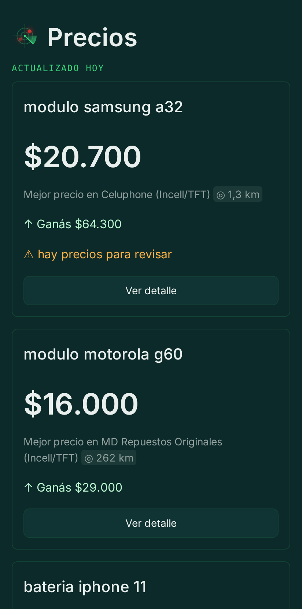
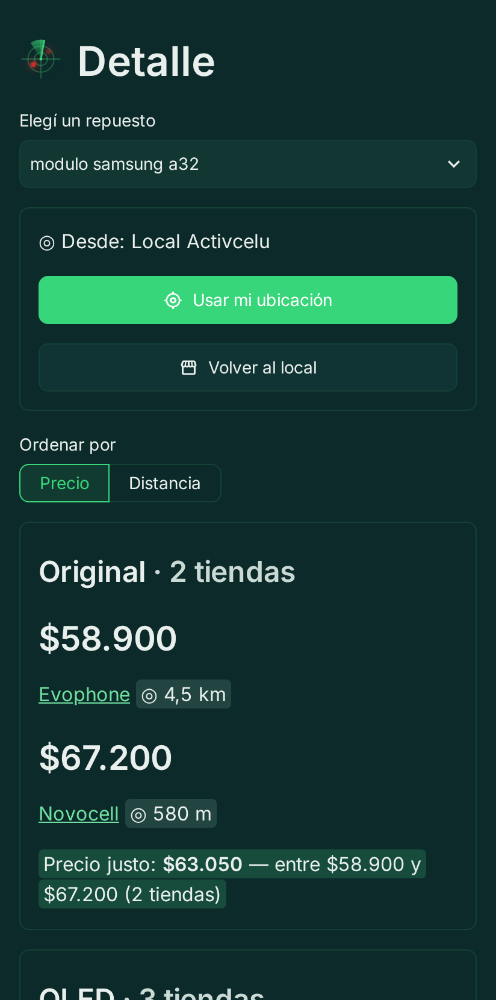
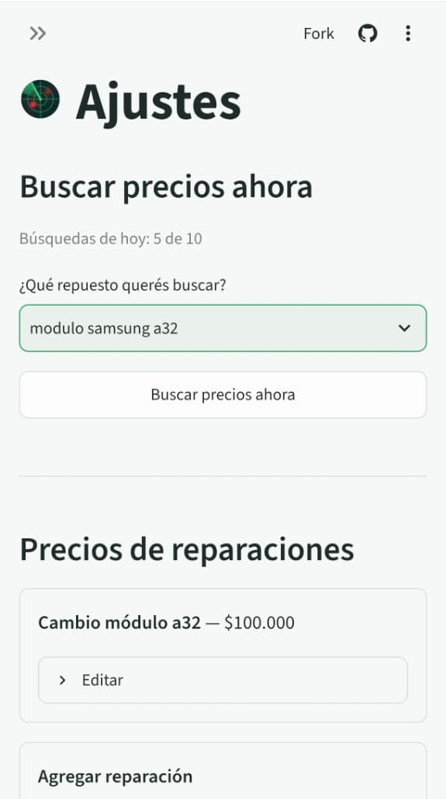

# repuestos-radar

[](https://github.com/ZahirJacob/repuestos-radar/actions/workflows/ci.yml)

> 🇬🇧 [Read this in English](README.md)

Inteligencia de mercado para talleres de reparación de celulares: sigue los precios de repuestos y
de celulares usados en revendedores locales verificados, guarda el historial en Postgres y
lo sirve en un dashboard que responde preguntas reales de precios.

## Qué es

repuestos-radar está hecho para un cliente real: un taller de reparación de celulares en Rosario,
Argentina. El taller compra módulos de pantalla, baterías y otros repuestos — y compra y vende
celulares usados — en un mercado donde los precios cambian todo el tiempo y presupuestar una
reparación implica revisar media docena de fuentes a mano.

Este proyecto automatiza eso: vigila los repuestos y equipos que le importan al taller, registra
los precios todos los días desde varias fuentes y convierte ese historial en respuestas — cuánto
sale hoy este módulo, quién lo tiene más barato, si esa oferta de un usado está por encima o por
debajo del mercado, y qué margen deja una reparación a los precios de hoy.

## Cómo funciona

1. **Ingesta diaria multi-fuente.** Un cron de GitHub Actions corre una vez por día y trae las
   publicaciones actuales de cada búsqueda seguida desde las tiendas online de los revendedores
   locales verificados del registro de fuentes.
2. **Historial de precios en Postgres.** Cada publicación se normaliza a un esquema común y se
   agrega a una base Postgres hosteada (Neon, plan gratuito), armando un historial de precios en
   el tiempo.
3. **Dashboard en Streamlit.** Un dashboard primero en español, detrás de una única contraseña
   compartida para toda la app, muestra precios actuales, historial y márgenes. Su página de
   administración gestiona la lista de seguimiento y la lista de precios de reparaciones — las
   búsquedas seguidas viven en una tabla de la base, así que el cliente agrega o saca ítems sin
   tocar código. El selector ES/EN y una demo pública sin contraseña son el siguiente paso
   comprometido después de M4.

## Fuentes de datos y política de confianza

Los precios valen lo que valen sus fuentes, así que cada fuente lleva metadatos de confianza:
dirección física, calificación y reseñas en Google e inscripción societaria, cuando se conocen.
Una fuente se agrega solo después de pasar una checklist de verificación documentada: tiene que
ser un comercio establecido con dirección verificable, precios públicos y stock consistente. El
registro vive en [`sources.yaml`](sources.yaml).

Fuentes actuales (comercios establecidos, de Rosario salvo que se indique otra ciudad):

| Fuente | Plataforma | Dirección | Cómo la leemos |
| --- | --- | --- | --- |
| Novocell | Wix | Av. Pellegrini 356 | Scraping respetuoso |
| Tienda Móvil | WooCommerce | Mendoza 1209 | Scraping respetuoso |
| Evophone | WooCommerce | Av. Pellegrini 4041 | Scraping respetuoso |
| Celuphone | WooCommerce | Santa Fe 4245 | Scraping respetuoso |
| Litoral Accesorios | WooCommerce | Mitre 1158 | Scraping respetuoso |
| MD Repuestos Originales | Tiendanube | Drysdale 5596, Carapachay — Vicente López (Bs. As.) | Scraping respetuoso |
| GoFix | Tiendanube | Av. Avelino Rolón 217 — CABA | Scraping respetuoso |
| One Store | Tiendanube | San Martín 1198 — Mendoza (ciudad) | Scraping respetuoso |

Las tiendas en Tiendanube no exponen una API JSON pública y sus rutas de búsqueda están
prohibidas por robots.txt, así que el adaptador recorre con respeto sus páginas de categoría
(JSON-LD de schema.org) una vez por corrida diaria en vez de buscar. El recorrido se puede ajustar
por fuente en `sources.yaml` con dos claves opcionales: `priority_categories` (slugs de categorías
para recorrer primero, en orden — así una tienda donde solo importan algunas categorías, como las
de celulares de One Store, queda cubierta antes de que se agote el presupuesto de páginas) y
`max_catalog_pages` (pisa el presupuesto por defecto de 80 páginas — el catálogo completo de
repuestos de MD Repuestos necesita 160). Si un slug prioritario ya no coincide con ninguna
categoría, queda un warning en el log, así nos enteramos cuando una tienda renombra o cambia el
slug de una categoría.

Una fuente también puede llevar `cloud_blocked`. Marca una tienda que responde HTTP 403 a
nuestras IPs de la nube aunque siga respondiendo normalmente desde IPs residenciales. Las dos nubes
no son iguales (GitHub Actions corre la ingesta diaria, Streamlit Cloud corre la búsqueda rápida),
así que la clave nombra canales: `true` bloquea los dos (la forma canónica de decir "ambos"),
`[daily]` o `[quick]` bloquea solo ese, y `false` o sin la clave no bloquea ninguno. Según la
política de cortesía, a una tienda bloqueada se la saltea, no se le busca la vuelta: la corrida
diaria deja afuera las tiendas bloqueadas para `daily` (el reporte de ingesta las lista como
`status=skipped reason=cloud_blocked`) y la búsqueda rápida deja afuera las bloqueadas para `quick`
(el dashboard lo avisa con una nota propia), mientras que un `--source SLUG` explícito sí corre la
tienda, para poder volver a probarla. La tienda queda en el registro, así el dashboard puede seguir
mostrando su nombre y su distancia. Hoy Evophone tiene `[daily]` (responde 403 a GitHub Actions
pero sí contesta a Streamlit Cloud, así que sigue en la búsqueda rápida) y Litoral Accesorios tiene
`true` (403 desde las dos nubes), confirmados el 2026-09-02; sacar la clave reactiva la tienda en
todos lados.

**¿Por qué no MercadoLibre?** Su API de búsqueda de publicaciones está restringida a partners
certificados (las credenciales comunes de aplicación y de usuario reciben 403), y sus páginas de
publicaciones redirigen los requests automatizados — incluso con user-agent honesto — a un muro de
verificación. Nuestra propia política de cortesía dice que los sitios que rechazan el acceso
automatizado se saltean, no se les busca la vuelta, así que no incorporamos los precios de
MercadoLibre.
Las credenciales de ML quedan en uso solo para la API de catálogo (normalización de nombres de
producto, en un hito posterior).

## Política de cortesía en el scraping

Las tiendas locales se scrapean con respeto, y esto no se negocia:

- **Una vez por día** — una sola corrida programada, nunca más que eso.
- **Se respeta robots.txt** — las rutas no permitidas no se tocan.
- **User-agent honesto** — los requests identifican al proyecto; no nos hacemos pasar por un
  navegador.
- **Backoff ante errores** — si una fuente falla, se reintenta con calma y después se saltea por
  ese día.
- **Los sitios que bloquean bots se saltean** — si un sitio deja claro que no quiere acceso
  automatizado, se lo saca de la rotación en vez de buscarle la vuelta.

## Arquitectura

Cada fuente es un adaptador autocontenido detrás de una interfaz común: el adaptador sabe cómo
descargar y parsear una fuente, y emite publicaciones en un único esquema normalizado — **ítem,
precio, condición, fuente, fecha**. El job de ingesta corre todos los adaptadores, junta las
publicaciones normalizadas y las escribe en Postgres. Todo lo que viene después (análisis,
dashboard, alertas) solo ve el esquema normalizado, así que agregar una fuente nunca toca el
resto del sistema.

```
Novocell (Wix) ─────┐
Tienda Móvil (Woo) ─┼──► adaptadores por fuente ──► publicaciones normalizadas ──► Postgres ──► dashboard
Evophone (Woo) ─────┤      (descarga + parseo)      (ítem, precio, condición,                   análisis
Celuphone (Woo) ────┘                                fuente, fecha)                             alertas
```

## Hoja de ruta

- **M0 — Andamiaje** *(este PR)*: estructura del proyecto, CI, documentación.
- **M1 — Ingesta**: adaptadores de las tiendas locales verificadas, esquema normalizado de
  publicaciones, escritura en Postgres.
- **M2 — Automatización diaria**: cron de GitHub Actions, manejo de errores, backoff, reportes de
  cada corrida.
- **M3 — Capa de análisis**: consultas sobre el historial, mejor precio y tendencias, cálculo de
  márgenes.
- **M4 — Dashboard + administración**: app en Streamlit pensada primero para el celular, en
  español, detrás de una contraseña compartida — tarjetas por repuesto, ranking de tiendas por
  nivel de calidad con distancias en línea recta, precios justos, márgenes, búsqueda rápida a
  pedido y una página de administración para precios de reparaciones y repuestos vigilados.
- **M5 — Alertas y pronósticos**: alertas de baja de precio y pronósticos simples de tendencia.
- **Post-M4 — Demo pública**: un despliegue apto para portfolio con datos de muestra, sin
  contraseña y con selector ES/EN.

## Entorno de desarrollo

Requiere Python 3.12 o superior.

```bash
git clone https://github.com/ZahirJacob/repuestos-radar.git
cd repuestos-radar
python -m venv .venv && source .venv/bin/activate
pip install -e ".[dev]"
```

Configurá las variables de entorno copiando la plantilla y completando los valores reales (nunca
se commitean — `.env` está en el gitignore):

```bash
cp .env.example .env
```

Corré los chequeos:

```bash
ruff check .
ruff format --check .
pytest
```

## Correr una ingesta

El runner de ingesta trae las publicaciones actuales de todas las fuentes verificadas para cada
búsqueda seguida activa, las etiqueta con el filtro de relevancia y las guarda como snapshots
diarios. Necesita `DATABASE_URL` en el entorno (o en `.env`) — una URL de Postgres o SQLite; las
tablas se crean automáticamente si no existen.

```bash
python -m repuestos_radar.ingest
```

Para probar una sola tienda sin tocar el resto, `--source SLUG` (repetible) limita la corrida a
las fuentes nombradas; un slug desconocido aborta la corrida al arrancar, igual que cualquier otro
error de configuración:

```bash
python -m repuestos_radar.ingest --source onestore --source gofix
```

El reporte de la corrida sale por stdout como líneas `clave=valor` fáciles de grepear — por
fuente: búsquedas consultadas, publicaciones traídas, productos malformados salteados, filas
insertadas vs ya guardadas ese día, el desglose de relevancia (`match` / `low_confidence` /
`reject`) y el mensaje de error si la fuente no estuvo disponible — más una línea de resumen. Las
fuentes que se recorren por categorías (Tiendanube) también reportan la cobertura del recorrido:
`pages=12 crawl=full` significa que se recorrió el catálogo completo, y `pages=80 crawl=partial`
que se agotó el presupuesto de páginas y el catálogo puede estar incompleto. Una fuente que falla
nunca aborta la corrida: se reporta y las demás siguen. El código de salida es 0
cuando al menos una fuente funcionó (una corrida sin búsquedas activas es un no-op exitoso) y 1
cuando fallaron todas las fuentes o la corrida no pudo arrancar. El progreso se commitea después
de cada guardado por fuente/búsqueda y el almacenamiento es idempotente por día, así que volver a
correr después de una corrida interrumpida es seguro. Este es el job que corre dentro del workflow
de [automatización diaria](#automatización-diaria).

## Automatización diaria

Un workflow de GitHub Actions ([`ingest.yml`](.github/workflows/ingest.yml)) corre la ingesta una
vez por día a las 09:00 UTC (06:00 en Argentina) — exactamente una corrida programada por día, como
exige la política de cortesía de scraping. El job hace checkout del repo, instala las dependencias
fijadas con uv (`uv sync --locked`, contra el `uv.lock` commiteado) y corre
`python -m repuestos_radar.ingest`; el reporte de la corrida queda en el log del workflow. Un grupo de concurrencia evita que las corridas se superpongan, el job tiene un timeout
de 20 minutos y nunca se reintenta automáticamente.

Necesita el secret de repositorio `DATABASE_URL` (Settings → Secrets and variables → Actions) con
la cadena de conexión de Postgres. Hasta que el secret no esté configurado, las corridas abortan al
arrancar con `ingestion aborted (database error)` y una corrida en rojo — visible, inofensiva y se
arregla agregando el secret.

Para disparar una corrida a mano: Actions → "Daily ingestion" → "Run workflow", o
`gh workflow run ingest.yml`.

## Gestionar las búsquedas seguidas

La lista de seguimiento se gestiona desde la página de administración del dashboard (ver
[Dashboard (M4)](#dashboard-m4)); esta pequeña CLI de desarrollo sigue como herramienta interna
del equipo (mismo contrato de `DATABASE_URL` que el runner):

```bash
python -m repuestos_radar.tracked add "modulo samsung a34"
python -m repuestos_radar.tracked add "samsung s24 ultra" --kind phone
python -m repuestos_radar.tracked list
python -m repuestos_radar.tracked pause 3
python -m repuestos_radar.tracked resume 3
python -m repuestos_radar.tracked kind 3 phone
```

`add` con una búsqueda ya seguida te lo avisa en vez de fallar, y reactiva el ítem si estaba
pausado. Los ítems se pausan, no se borran: un ítem pausado conserva su historial de precios y
simplemente queda afuera de la ingesta diaria.

Cada ítem tiene un tipo: `part` (repuesto, el valor por defecto) o `phone` (celular). La búsqueda de
un celular entero ("samsung s24 ultra") también encuentra todos los repuestos de ese modelo, así que
para un ítem `phone` el filtro de relevancia rechaza cualquier publicación cuyo título tenga una
palabra de repuesto (módulo, batería, flex, tapa…). Se define con `add --kind phone` o se cambia
después con `kind ID part|phone`; la página de administración hace la misma pregunta al agregar.

## Reporte diario y lista de precios de reparaciones

Dos CLIs de desarrollo más trabajan sobre el historial guardado (mismo contrato de `DATABASE_URL`
que el runner). Las dos son herramientas internas del equipo — la cara para el cliente es el
dashboard de M4, que muestra los mismos números, y su página de administración también gestiona
la lista de precios de reparaciones.

```bash
python -m repuestos_radar.report
```

Imprime el resumen del día en español: por búsqueda seguida y nivel de calidad, la tienda más
barata, un precio justo estimado (la mediana entre tiendas, con su rango cuando pocas tiendas
venden el repuesto), avisos sobre coincidencias dudosas y precios sospechosos, tendencias a 7 y 30
días, y el margen que deja cada reparación a los precios de repuestos de hoy.

```bash
python -m repuestos_radar.services add "Cambio módulo A32" --item 3 --price 75000
python -m repuestos_radar.services list
python -m repuestos_radar.services set-price 2 80000
python -m repuestos_radar.services remove 2
```

Gestiona la lista de precios de reparaciones de la que salen esos márgenes: lo que el taller cobra
por cada reparación, vinculada a la búsqueda seguida cuyo repuesto consume esa reparación.

## Dashboard (M4)

La cara para el cliente: una app en Streamlit pensada primero para el celular, en español, detrás
de una única contraseña compartida. El inicio muestra una tarjeta por repuesto vigilado (mejor
precio, margen, avisos); la página de detalle ordena las tiendas por nivel de calidad con precios
justos, distancias en línea recta, márgenes por reparación y tendencias de precio; la página de
administración (Ajustes) gestiona los precios de las reparaciones y los repuestos vigilados, y
corre una búsqueda rápida a pedido. La pantalla de ingreso abre con el radar de la app
(`dashboard/radar.py`): un barrido hecho solo con CSS cuyos puntos rojos destellan cuando la línea
pasa por ellos, más una línea de estado con la cantidad de tiendas alcanzables desde la nube. El
título de cada página lleva el mismo radar como logo chico; la animación se detiene con
`prefers-reduced-motion`.

Los colores de la app viven en `.streamlit/config.toml`: un tema claro y uno oscuro construidos
sobre el verde del radar. La app sigue la configuración del celular, y el tema se puede cambiar a
mano desde el menú de la app. El radar conserva su propia paleta en los dos temas. En la página de
detalle, "Usar mi ubicación" le pide al navegador la posición del celular a través de
`streamlit-js-eval`. La lectura se conserva solo durante la sesión y nunca se guarda; "Volver al
local" la descarta.

Para correrla localmente:

```bash
uv sync --extra dashboard
DATABASE_URL=... APP_PASSWORD=... uv run streamlit run streamlit_app.py
```

En producción la app corre en Streamlit Community Cloud, desplegada desde `main`. Su configuración
vive en los secrets de la app (configuración de la app → Secrets en la interfaz de Streamlit
Cloud) — nunca se commitea al repo:

| Secret         | Qué es                                                                              |
| -------------- | ----------------------------------------------------------------------------------- |
| `DATABASE_URL` | Cadena de conexión de Postgres — la misma base en la que escribe la ingesta diaria. |
| `APP_PASSWORD` | La contraseña compartida detrás de la que está toda la app.                         |
| `SHOP_LAT`     | Latitud del local — el punto de referencia por defecto para las distancias.         |
| `SHOP_LON`     | Longitud del local — se mantiene fuera del repo público junto con `SHOP_LAT`.       |

La búsqueda rápida ("Buscar precios ahora") busca un repuesto en el buscador propio de cada
tienda que tenga uno, en paralelo pero con respeto (cada tienda sigue viendo un único visitante
secuencial), y tiene un tope fijo de 10 corridas por día calendario. Las tiendas en Tiendanube
quedan solo para la corrida diaria: el robots.txt de la plataforma prohíbe `/search/`, y según
la política de cortesía las salteamos en vez de buscarles la vuelta — el recorrido diario las
sigue cubriendo.

### Capturas de pantalla

Capturas de la app desplegada:




