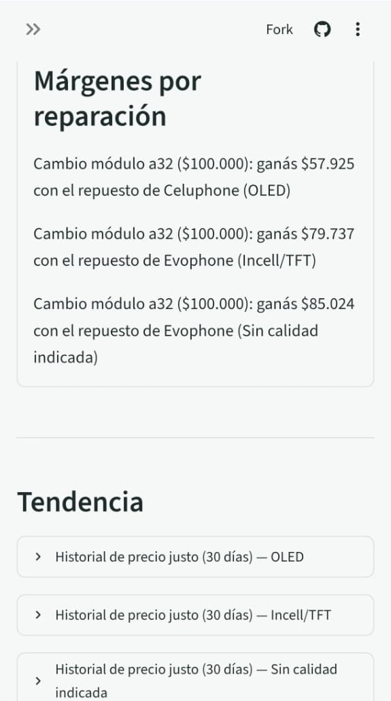
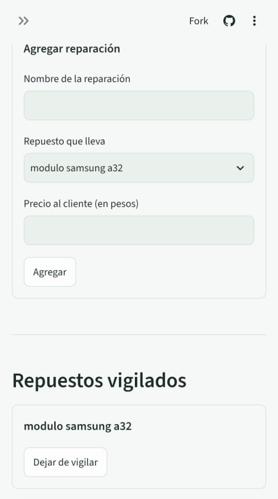
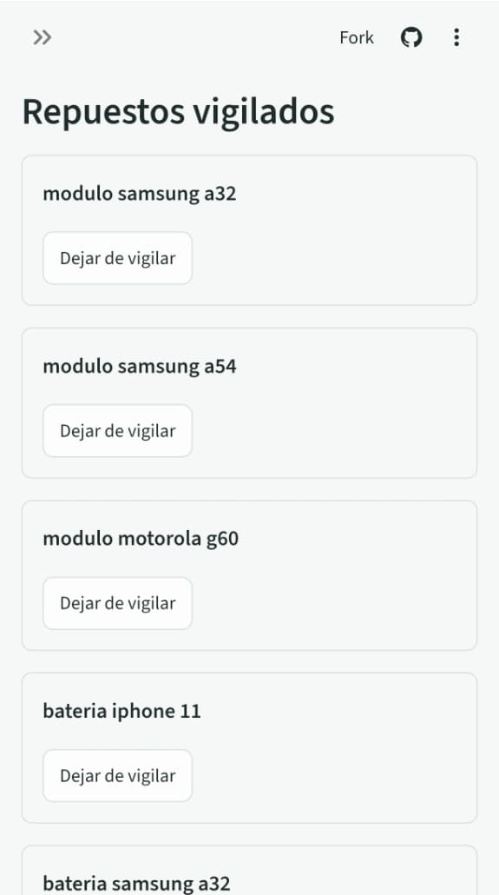
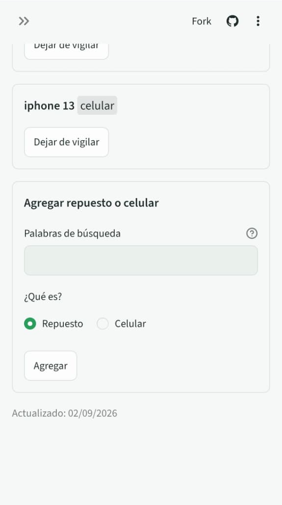

# repuestos-radar

[](https://github.com/ZahirJacob/repuestos-radar/actions/workflows/ci.yml)

> 🇦🇷 [Leé esto en español](README.es.md)

Market intelligence for phone repair shops: tracks prices of phone parts and used phones
across vetted local resellers, stores the history in Postgres, and serves a dashboard
that answers real pricing questions.

## What it is

repuestos-radar is built for a real client: a phone repair shop in Rosario, Argentina. The shop
buys screens, batteries, and other spare parts — and buys and sells used phones — in a market
where prices move constantly and quoting a repair means checking half a dozen sources by hand.

This project automates that: it watches the parts and phones the shop cares about, records prices
daily from multiple sources, and turns the history into answers — what does this screen cost today,
who has it cheapest, is this used phone offer above or below market, and what margin does a repair
leave at current prices.

## How it works

1. **Daily multi-source ingestion.** A GitHub Actions cron job runs once a day and fetches current
   listings for every tracked search item from the vetted local reseller storefronts in the
   source registry.
2. **Postgres price history.** Every listing is normalized into a common schema and appended to a
   hosted Postgres database (Neon free tier), building a price history over time.
3. **Streamlit dashboard.** A Spanish-first dashboard, behind one shared password for the whole
   app, shows current prices, history, and margins. Its admin page manages the watchlist and the
   repair price list — tracked search items live in a database table, so the client adds or
   removes items without touching code. A password-free **public demo** with generated sample
   data and an ES/EN toggle runs from the same code (see [Public demo](#public-demo)).

## Data sources and trust policy

Prices are only as good as their sources, so every source carries trust metadata: physical address,
Google rating and reviews, and company registration, where known. A source is only added after it
passes a documented vetting checklist: it must be an established business with a verifiable
address, public prices, and consistent stock. The registry lives in [`sources.yaml`](sources.yaml).

Current sources (established storefronts, in Rosario unless noted):

| Source | Platform | Address | How we read it |
| --- | --- | --- | --- |
| Novocell | Wix | Av. Pellegrini 356 | Polite scraping |
| Tienda Móvil | WooCommerce | Mendoza 1209 | Polite scraping |
| Evophone | WooCommerce | Av. Pellegrini 4041 | Polite scraping |
| Celuphone | WooCommerce | Santa Fe 4245 | Polite scraping |
| Litoral Accesorios | WooCommerce | Mitre 1158 | Polite scraping |
| MD Repuestos Originales | Tiendanube | Drysdale 5596, Carapachay — Vicente López, Buenos Aires | Polite scraping |
| GoFix | Tiendanube | Av. Avelino Rolón 217 — Buenos Aires (CABA) | Polite scraping |
| One Store | Tiendanube | San Martín 1198 — Mendoza (city) | Polite scraping |

Tiendanube stores expose no public JSON API and their search paths are robots-disallowed, so the
adapter politely crawls their category pages (schema.org JSON-LD) once per daily run instead of
searching. The crawl is tunable per source in `sources.yaml` with two optional keys:
`priority_categories` (category path slugs to crawl first, in order — so a store where only some
categories matter, like One Store's phone categories, is covered before the page budget runs out)
and `max_catalog_pages` (overrides the default 80-page crawl budget — MD Repuestos' full parts
catalog needs 160). A priority slug that no longer matches any category logs a warning, so a store
re-slugging a category gets noticed.

A source can also carry `cloud_blocked`. That marks a store that answers HTTP 403 to our cloud
IPs while still serving residential visitors. The two clouds differ (the daily run lives on GitHub
Actions, the dashboard's quick search on Streamlit Cloud), so the flag names channels: `true`
blocks both (`[daily, quick]` also parses, but `true` is the spelling we use), `[daily]` or
`[quick]` blocks only that one, and `false` or no key blocks none. Per the courtesy policy, a blocked store is skipped, not worked around: the
daily run leaves out stores blocked for `daily` (the ingest report lists them as
`status=skipped reason=cloud_blocked`) and the quick search leaves out stores blocked for `quick`
(the dashboard says so in its own note), while an explicit `--source SLUG` still runs a store so it
can be re-tested. The store stays in the registry, so the dashboard can still show its name and
distance. Today Evophone is `[daily]` (it 403s GitHub Actions but answers Streamlit Cloud, so it is
still in the quick search) and Litoral Accesorios is `true` (403s from both clouds), both confirmed
2026-09-02; removing the key re-enables the store everywhere.

**Why not MercadoLibre?** Its listing-search API is restricted to certified partners (regular app
and user credentials get 403s), and its listing pages redirect automated requests — even with an
honest user-agent — to a verification wall. Our own courtesy policy says sites that decline
automated access get skipped, not worked around, so we do not ingest MercadoLibre prices. The ML
credentials stay in use only for the product-catalog API (product-name normalization, in a later
milestone).

## Scraping courtesy policy

Local storefronts are scraped politely, and this is non-negotiable:

- **Once per day** — a single scheduled run, never more.
- **robots.txt is honored** — disallowed paths are never fetched.
- **Honest user-agent** — requests identify the project; no browser impersonation.
- **Backoff on errors** — failing sources are retried gently, then skipped for the day.
- **Bot-blocking sites are skipped** — if a site signals it does not want automated access, it is
  removed from the rotation rather than worked around.

## Architecture overview

Each source is a self-contained adapter behind a common interface: an adapter knows how to fetch
and parse one source, and emits listings in a single normalized schema — **item, price, condition,
source, date**. The ingestion job runs every adapter, collects normalized listings, and writes them
to Postgres. Everything downstream (analysis, dashboard, alerts) only ever sees the normalized
schema, so adding a source never touches the rest of the system.

```
Novocell (Wix) ─────┐
Tienda Móvil (Woo) ─┼──► per-source adapters ──► normalized listings ──► Postgres ──► dashboard
Evophone (Woo) ─────┤        (fetch + parse)     (item, price, condition,             analysis
Celuphone (Woo) ────┘                             source, date)                       alerts
```

## Roadmap

- **M0 — Scaffold** *(this PR)*: project layout, CI, docs.
- **M1 — Ingestion**: storefront adapters for the vetted sources, normalized listing schema,
  Postgres writes.
- **M2 — Daily automation**: GitHub Actions cron, error handling, backoff, run reports.
- **M3 — Analysis layer**: price history queries, best-price and trend calculations, margin math.
- **M4 — Dashboard + admin page**: phone-first Streamlit app in Spanish behind a shared
  password — part cards, per-tier store ranking with straight-line distances, fair prices,
  margins, quick search on demand, and an admin page for repair prices and tracked parts.
- **M5 — Alerts and forecasting**: price-drop alerts and simple trend forecasts.
- **Post-M4 — Public demo** *(shipped)*: a portfolio-friendly deployment with sample data, no
  password, and an ES/EN toggle.

## Dev setup

Requires Python 3.12+.

```bash
git clone https://github.com/ZahirJacob/repuestos-radar.git
cd repuestos-radar
python -m venv .venv && source .venv/bin/activate
pip install -e ".[dev]"
```

Configure environment variables by copying the template and filling in real values (never commit
them — `.env` is gitignored):

```bash
cp .env.example .env
```

Run the checks:

```bash
ruff check .
ruff format --check .
pytest
```

## Running an ingestion

The ingestion runner fetches current listings from every vetted source for every active tracked
item, labels them with the relevance filter, and stores them as daily snapshots. It needs
`DATABASE_URL` set in the environment (or in `.env`) — a Postgres or SQLite URL; tables are
created automatically if missing.

```bash
python -m repuestos_radar.ingest
```

To test one shop without touching the rest, `--source SLUG` (repeatable) restricts the run to the
named source(s); an unknown slug aborts the run at startup like any other config error:

```bash
python -m repuestos_radar.ingest --source onestore --source gofix
```

The run report goes to stdout as grep-able `key=value` lines — per source: tracked items queried,
listings fetched, malformed products skipped, rows inserted vs already stored for the day, the
relevance breakdown (`match` / `low_confidence` / `reject`), and the failure message if the source
was unreachable — plus a summary line. Crawl-based sources (Tiendanube) also report their crawl
coverage: `pages=12 crawl=full` means the whole catalog was crawled, `pages=80 crawl=partial` means
the page budget ran out and the catalog may be incomplete. A failing source never aborts the run:
it is reported and
the rest continue. The exit code is 0 when at least one source succeeded (a run with no active
tracked items is a successful no-op) and 1 when every source failed or the run could not start.
Progress is committed after each source/item save and storage is idempotent per day, so re-running
after a crash is safe. This is the job the [daily automation](#daily-automation) workflow runs.

## Daily automation

A GitHub Actions workflow ([`ingest.yml`](.github/workflows/ingest.yml)) runs the ingestion once a
day at 09:00 UTC (06:00 in Argentina) — exactly one scheduled run per day, as the scraping courtesy
policy requires. The job checks out the repo, installs the locked dependencies with uv
(`uv sync --locked`, against the committed `uv.lock`), and runs `python -m repuestos_radar.ingest`;
the run report shows up in the workflow log. A concurrency
group keeps runs from ever overlapping, the job times out after 20 minutes, and it is never retried
automatically.

It needs the `DATABASE_URL` repository secret (Settings → Secrets and variables → Actions) with the
Postgres connection string. Until the secret is set, runs abort at startup with
`ingestion aborted (database error)` and a red run — visible, harmless, and fixed by adding the
secret.

To trigger a run manually: Actions → "Daily ingestion" → "Run workflow", or
`gh workflow run ingest.yml`.

## Managing tracked items

The watchlist is managed from the dashboard's admin page (see [Dashboard (M4)](#dashboard-m4));
this small dev CLI remains as an internal team tool (same `DATABASE_URL` contract as the runner):

```bash
python -m repuestos_radar.tracked add "modulo samsung a34"
python -m repuestos_radar.tracked add "samsung s24 ultra" --kind phone
python -m repuestos_radar.tracked list
python -m repuestos_radar.tracked pause 3
python -m repuestos_radar.tracked resume 3
python -m repuestos_radar.tracked kind 3 phone
python -m repuestos_radar.tracked reclassify --dry-run
python -m repuestos_radar.tracked reclassify 8 11
```

`add` on an already-tracked query says so instead of failing, and reactivates the item if it was
paused. Items are paused rather than deleted: a paused item keeps its price history and is simply
skipped by the daily ingestion.

Every tracked item has a kind: `part` (the default) or `phone`. The query for a whole phone
("samsung s24 ultra") also matches every spare part sold for it, so for a `phone` item the relevance
filter rejects any listing whose title carries a part word (módulo, batería, flex, tapa…). Set it with
`add --kind phone` or change it later with `kind ID part|phone`; the admin page asks the same
question when adding an item.

Stored listings keep the label they got on the day they were fetched. `reclassify` re-runs the
current filter over that history (every item, or the ids given) and rewrites every label the
current rules disagree with, so a new part word or an item switched to `phone` also cleans up the
days already stored; `--dry-run` only reports the counts.

## Public demo

**<https://repuestos-radar-demo.streamlit.app>** — the same dashboard with no password, an ES/EN
toggle, and generated sample data, so anyone can click around without seeing the client's numbers.

- Entry point `demo_app.py` (the client's app keeps `streamlit_app.py`). It sets
  `REPUESTOS_RADAR_DEMO=1` before the app starts, so the demo deployment needs **no secrets**.
- In demo mode the dashboard never reads `DATABASE_URL`. It works on a throw-away SQLite file
  seeded by `repuestos_radar.dashboard.demo` with thirty days of made-up prices for five items
  (four parts, one phone) across the registry's real stores — their names and distances are
  real, the prices are not, and a banner says so. The sample is deterministic and always ends on
  the current day; one tier carries a deliberate outlier and one a low-confidence title so the
  warnings show. Distances are measured from a public spot in central Rosario, not the shop.
- The login is skipped, the Settings page is read-only (lists only, no forms), and the quick
  search is off — it would hit the real stores.
- Language: the ES/EN control in the banner, or `?lang=en` in the URL for a shared link. Spanish
  is the default; the client's app has no toggle.

Run it locally with `uv run streamlit run demo_app.py`. To deploy it, create one more Streamlit
Community Cloud app on this repository with `demo_app.py` as the main file and no secrets.

## Daily report and repair price list

Two more dev CLIs sit on top of the stored history (same `DATABASE_URL` contract as the runner).
Both are internal team tools — the client-facing surface is the M4 dashboard, which shows the same
numbers, and its admin page also manages the repair price list.

```bash
python -m repuestos_radar.report
```

Prints the day's summary in Spanish: per tracked item and quality tier, the cheapest store, a
fair-price estimate (median across stores, with its range when few stores sell the part), warnings
about dubious matches and suspicious prices, 7/30-day trends, and the margin each repair leaves at
today's part prices.

```bash
python -m repuestos_radar.services add "Cambio módulo A32" --item 3 --price 75000
python -m repuestos_radar.services list
python -m repuestos_radar.services set-price 2 80000
python -m repuestos_radar.services remove 2
```

Manages the repair price list those margins are computed from: what the shop charges for each
repair, linked to the tracked item whose part the repair consumes.

## Dashboard (M4)

The client-facing surface: a phone-first Streamlit app in Spanish, behind one shared password.
Home shows a card per tracked part (best price, margin, warnings); the detail page ranks stores
per quality tier with fair prices, straight-line distances, margins per repair, and price trends;
the admin page (Ajustes) manages repair prices and tracked parts and runs a quick search on
demand. The login screen opens with the app's radar (`dashboard/radar.py`): a CSS-only sweep whose
red blips flash as the line passes them, plus a status line with the number of stores reachable
from the cloud. Every page title carries the same radar as a small logo; motion stops under
`prefers-reduced-motion`.

The login is hardened for a public URL. Wrong passwords are throttled process-wide: after three
in ten minutes, every further wrong attempt (from any session) waits 2, 4, 8 … seconds, capped at
30, so a guesser is slowed down without ever locking the shop out; a correct password never waits.
A correct password sets a 30-day
"remember me" cookie (`secure`, `SameSite=Strict`) holding an expiry and an HMAC; the signing key
is derived with a slow KDF (PBKDF2, 600k rounds) of the password plus the optional
`APP_COOKIE_SECRET`, so a copied cookie is not an offline password-cracking oracle. Changing the
password or the secret logs every device out; the sidebar's "Salir" button logs out just this one.
`.streamlit/config.toml` keeps tracebacks out of the browser (`showErrorDetails = "type"`: the
client sees the exception type, the server log keeps the message), hides the deploy/fork toolbar,
and turns off usage telemetry.

The app's look follows the "1a Fiel" direction of the Claude Design project (2026-09-04): big
cards with one action each, price first, Inter at medium weight, 8px radii, section rules that
fade at their ends, and the radar ground as the dark theme. Colors, type scale and font live in
`.streamlit/config.toml`: a light and a dark theme built on the radar's green. The app follows
the phone's setting, and the theme can be switched by hand from the app menu. The radar itself
keeps its own palette in both themes. Inter is shipped with the app (`static/fonts`, SIL Open
Font License) through Streamlit's static serving, so the phone downloads it once, caches it,
and never calls a font host. On the detail page, "Usar mi
ubicación" asks the browser for the phone's position through `streamlit-js-eval`. The reading is
kept for the session only and never stored; "Volver al local" drops it.

To run it locally:

```bash
uv sync --extra dashboard
DATABASE_URL=... APP_PASSWORD=... uv run streamlit run streamlit_app.py
```

The remember-me cookie is `secure`, so over plain HTTP it only survives on `localhost` (Chrome and
Firefox treat it as a secure context; Safari does not). Opening a local run from a phone over the
LAN (`http://192.168.x.x:8501`) still logs in, it just asks for the password on every visit.

In production the app runs on Streamlit Community Cloud, deployed from `main`. Its configuration
lives in the app's secrets (app settings → Secrets in the Streamlit Cloud UI) — never committed to
the repo:

| Secret         | What it is                                                                 |
| -------------- | -------------------------------------------------------------------------- |
| `DATABASE_URL` | Postgres connection string — the same database the daily ingestion writes. |
| `APP_PASSWORD` | The shared password the whole app sits behind.                             |
| `APP_COOKIE_SECRET` | Optional long random string mixed into the remember-me cookie signature (see above). Generate one with `python -c "import secrets; print(secrets.token_urlsafe(32))"`. |
| `SHOP_LAT`     | Shop latitude — the default reference point for distances.                 |
| `SHOP_LON`     | Shop longitude — kept out of the public repo together with `SHOP_LAT`.     |

Quick search ("Buscar precios ahora") queries every search-capable store's own search endpoint for
one part, in parallel but politely (each store still sees a single sequential visitor), and is
hard-capped at 10 runs per calendar day. The Tiendanube stores are daily-only: the platform's
robots.txt disallows `/search/`, and per the courtesy policy we skip rather than work around — the
daily crawl keeps covering them.

### Screenshots

Screenshots of the deployed app on a phone. The repair price and margins shown ($100.000) are a
placeholder entered for testing, not the client's real pricing.

| Precios | Detalle | Detalle (márgenes y tendencia) |
| --- | --- | --- |
|  |  |  |

| Ajustes (búsqueda rápida y reparaciones) | Ajustes (agregar reparación) | Ajustes (repuestos vigilados) | Ajustes (agregar repuesto o celular) |
| --- | --- | --- | --- |
|  |  |  |  |
